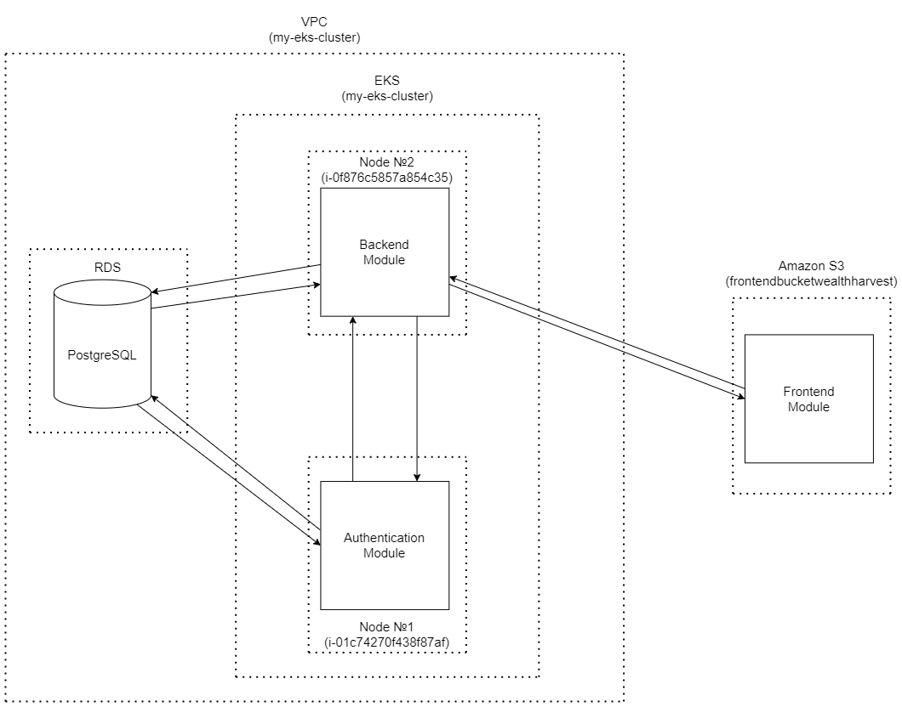

# MDP Project - WealthHarvest

This project is a final project for the FMI Course "Modern DevOps Practices" (MDP). The idea behind it is an app that helps users track their budget and save money in the processs.

### Code Organization

All the code of the app is centralized in this repo (as a monorepo, under [`repos`](./repos)). At this time there are 3 main modules in this project:
<pre>
- <a href="https://github.com/asen-krasimirov/WealthHarvest/tree/main/repos/backend">backend</a>  -> Containing the business logic of the application (as of now it consists of an FastAPI api).
- <a href="https://github.com/asen-krasimirov/WealthHarvest/tree/main/repos/auth">auth</a>     -> This module is responsible for handling of the authentication logic (made separate for easier replacement in the future).
- <a href="https://github.com/asen-krasimirov/WealthHarvest/tree/main/repos/frontend">frontend</a> -> A module that handles the client facing logic of the application.
</pre>

### Architecture, Deployment and Infrastructure

All the logic is handled by the `backend` of the application, which consists of and API, being exposed only to the `frontend`.

All components are deployed on **AWS** using:
- **VPC** for all resources (except `frontend`)
- **ECR** for Docker repository
- **EKS** for a Kubernetes cluster
- **RDS** handling of the database (multiple in the future)
- **S3** as a bucket for the `frontend`

> [!Note]
> Terraform is used to configure all the **AWS** resources ([`terraform`](./terraform)).

`backend` and `auth`'s images are deployed on **ECR** (serving as a private Docker repository).

The `frontend` is deployed on a **AWS S3** bucket.

The `backend` and `auth` run on *Kubernetes* (**EKS** on **AWS**), which handles all of the deployments.
Each component is containerized individually and runs in a separate pod. 
*Kubernetes* configs are in the [`kubernetes`](./kubernetes) directory.

The `backend` (and `auth`) component uses a PostgreSQL (**RDS** on **AWS**) database to store user information and app data.

### Instruments for Static Code Validation
<pre>
<i>flake8</i>               -> Runs flake8 to perform static code analysis on Python files, identifying syntax errors and enforcing coding standards.

<i>editorconfig-checker</i> -> Ensures that all files adhere to <i>.editorconfig</i> rules for consistent formatting and coding styles.

<i>cli-markdown</i>         -> Validate and check for issues in Markdown (.md) files.

<i>sonarqube</i>            -> Runs a SonarQube scan to detect bugs, vulnerabilities, and code smells across the codebase, providing detailed analysis.

<i>gitleaks</i>             -> Scans the repository for hardcoded secrets and sensitive information to enhance security.

<i>flyway</i>               -> (Currently disabled) Runs Flyway to verify database migrations against the target database for consistency and correctness.
</pre>
### Workflow Organization (CI/CD explanation)

On every change (*push*, *pull request*, *opened issues*) the Main workflow triggers: [`main_workflow.yml`](./.github/workflows/main_workflow.yml)

This workflow triggers all the above tools for static code validation.

The workflows for development in this project are separated as the components are:
- [`backend_workflow.yml`](./.github/workflows/backend_workflow.yml)
- [`auth_workflow.yml`](./.github/workflows/auth_workflow.yml)
- [`frontend_workflow.yml`](./.github/workflows/frontend_workflow.yml)

And there is an additional one, for handling deployment of the terraform files:
- [`terraform_workflow.yml`](./.github/workflows/terraform_workflow.yml)

> [!Note]
> They trigger on change in the given repo.

They consist of component specific jobs like checking for dependency errors and run tests and handle deploying for all given componetents:
- *snyk* and *unittests* and deployment to **ECR** and to **EKS** for `backend` and `auth`
- syncs the **S3** bucket for `frontend`
- initializes, plans and applies configuration for `terraform`

> [!Important]
> In order for the deployment jobs to run you need to add `[backend]`, `[auth]`, `[frontend]`, or `[tarraform]` tag in the commit message of the given change.  
> This is made with governence purposes for the **AWS** resouces.
